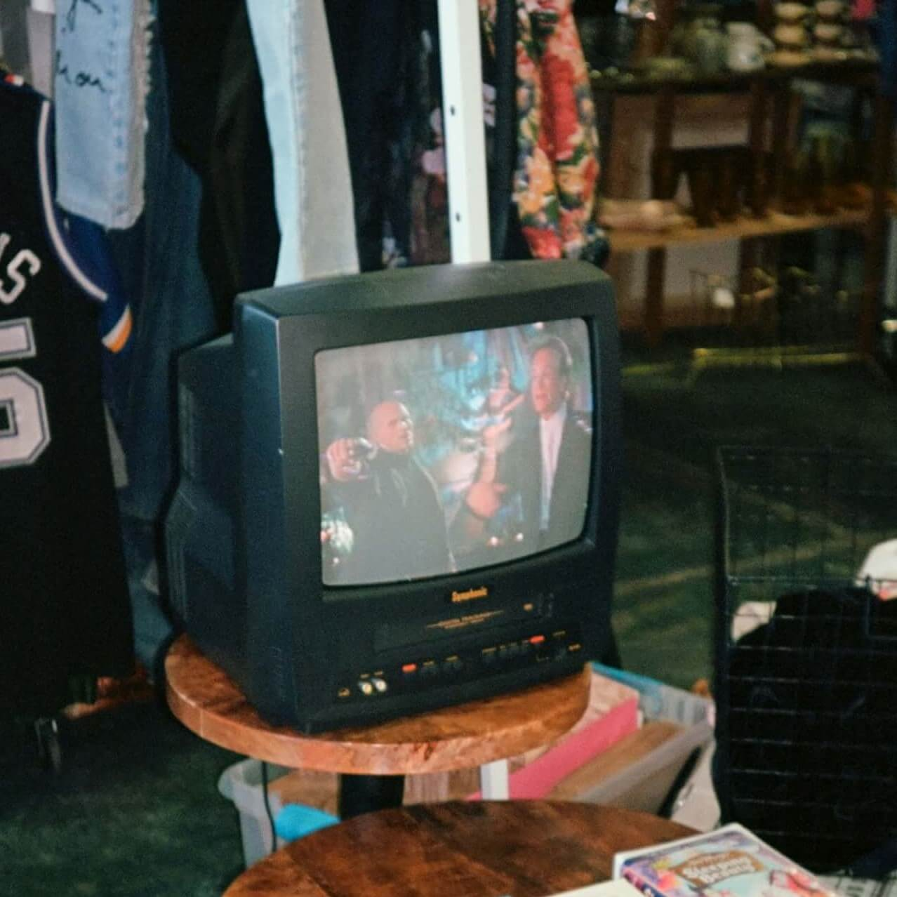

.. _favicon:

===================================
Generating random animated favicons
===================================

.. _Inventing on Principle: https://youtu.be/PUv66718DII

I created this website for fun. Yet the design is kinda boring. `Inventing on
Principle`_ inspired me to start making computer-generated art, but I don't
know anything about graphics. Where to begin…?

Well, favicons are cool, and this site doesn't have one. And they're only
16x16 pixels\ :sup:`1`. I can handle that. Heck, I can even hard-code all
256 pixels if I get really desperate. Time to start hacking!

.. raw:: html

   <noscript>
     You appear to have JavaScript disabled. You should be able to follow along with
     most of the post, but you won't be able to see the demos, because they're
     generated via JavaScript.
   </noscript>

.. _What is the best favicon size?: https://mailchimp.com/resources/favicon-size/
.. _Build an adaptive favicon with SVG: https://web.dev/articles/building/an-adaptive-favicon

:sup:`1` Best practice is to provide multiple sizes: 16x16, 32x32,
96x96, 180x180, and 512x512. See `What is the best favicon size?`_ Or you can
`build an adaptive favicon with SVG`_. I'm just gonna focus on 16x16 for now.

---------
Prior art
---------

Don't know, don't care. I'm doing this for fun.

---------------
A first attempt
---------------

What if I just generate a random color in every pixel? What will that look like?

.. _Rocket: https://rocket.rs
.. _Render: https://render.com

In my first implementation, I generated the favicon server-side, in a
`Rocket`_ web app hosted on `Render`_. Notes on that experience:

* Render is nice. It's like Heroku, but not stuck in 2010.
* I've heard that Rust has a reputation of making simple things difficult.
  Boy, did it live it up to that reputation here. In Python or Node.js I
  would be able to get this running in 10-20 minutes, whereas with Rust it
  was more like 2-3 hours.
* Rocket's incomplete docs didn't help matters, either. E.g. there's no guidance
  on serving images or configuring CORS.

But anywho, I did eventually get it working and was pretty excited by the
result:

.. raw:: html

   

   

Is that TV static?! That looks like TV static. But 16x16 is hard
to see. Let's try 100x100.

.. raw:: html

   

   

It is TV static!! Obvious in hindsight, but I did not expect that.

-----------------------------------------------
Tangential inquiry into the nature of TV static
-----------------------------------------------

What the heck is TV static, anyways? It was one of those things that
just existed in the background of my 90s childhood, before I got curious
about technology.

First, I guess I have to explain the experience of TV static to my fellow
hackers born in the 2000s and later, because they have possibly never seen it.

In my room I had a small TV like this:

   `Source <https://unsplash.com/photos/a-television-sitting-on-top-of-a-wooden-table-p6v-BExkaWg>`_

As you flipped through the channels\ :sup:`2` you would eventually encounter
something like this:

.. raw:: html

   <iframe src="https://www.youtube.com/embed/J_FVFMdiZ0w"
           title="An example of TV static"
           frameborder="0"
           referrerpolicy="strict-origin-when-cross-origin"
           allowfullscreen></iframe>

That's TV static. So what the heck is it?

https://socialsci.libretexts.org/Bookshelves/Communication/Journalism_and_Mass_Communication/Book%3A_Mass_Communication_Media_and_Culture/09%3A_Television/9.01%3A_The_Evolution_of_Television?hl=en-US

https://www.highdefdigest.com/news/show/tv-static-comes-from-a-surprising-source-the-big-bang/39610

https://www.howtogeek.com/840090/why-dont-tvs-have-static-and-white-noise-anymore/

https://youtu.be/P_Oh7HizY5I

:sup:`2` Given the UX of Netflix, YouTube, etc. where you always actively choose
something to watch (or the algorithm guesses at what to show you next) I'm not even
sure if youngins will understand the concept of channels, but that's the limit of my
patience. You'll have to look that one up yourself.

-------------
Random colors
-------------

My first idea 

In the HTML the favicon was fetched from an external web service running on

In my first attempt the favicon was fetched from an external web service:

.. code-block:: html

   …
   <head>
       …
       <link id="favicon" rel="icon" type="image/x-icon" href="https://biodigitaljazz.onrender.com/favicon.ico">
       …
   </head>
   …

What if I just put a random color in each pixel of the 16x16 grid? Rust is cool.
Can I do it in Rust? With a lot of help from my friends Gemini and Claude I did
eventually get something working.

--------
Appendix
--------

.. _favicon-rs:

Rust implementation
===================

In the HTML the favicon was fetched from my web app running on `Render`_:

.. code-block:: html

   …
   <head>
       …
       <link id="favicon" rel="icon" type="image/x-icon" href="https://biodigitaljazz.onrender.com/favicon.ico">
       …
   </head>
   …

``src/main.rs`` contained a `Rocket`_ web app that handled the favicon generation:

.. code-block:: rs

   // I'm a Rust n00b and I leaned on Gemini and Claude to generate a lot of this
   // code, so it's probably crap (but at least it was working crap!)

   #[macro_use]
   extern crate rocket;
   
   use image::{ImageBuffer, Rgb};
   use rand::prelude::*;
   use rocket::Request;
   use rocket::http::{ContentType, Header, Status};
   use rocket::response::{self, Responder, Response};
   use std::io::Cursor;
   
   pub struct Favicon<R>(pub R);
  
   // For anything beyond super basic responses it seems like you need
   // to implement one of these responder things? It felt pretty
   // convoluted, IMO…
   impl<'r, 'o: 'r, R: Responder<'r, 'o>> Responder<'r, 'o> for Favicon<R> {
       fn respond_to(self, req: &'r Request<'_>) -> response::Result<'o> {
           Response::build_from(self.0.respond_to(req)?)
               .header(Header::new(
                   "Cache-Control",
                   "no-cache, no-store, must-revalidate",
               ))
               .header(Header::new("Pragma", "no-cache"))
               .header(Header::new("Expires", "0"))
               .header(Header::new(
                   "Access-Control-Allow-Origin",
                   "https://biodigitaljazz.net",
               ))
               .ok()
       }
   }
   
   fn generate_favicon() -> Result<Vec<u8>, image::ImageError> {
       let mut rng = rand::rng();
       let mut img = ImageBuffer::new(16, 16);
       for (_, _, pixel) in img.enumerate_pixels_mut() {
           let r: u8 = rng.random::<u8>();
           let g: u8 = rng.random::<u8>();
           let b: u8 = rng.random::<u8>();
           *pixel = Rgb([r, g, b]);
       }
       let mut buffer = Cursor::new(Vec::new());
       img.write_to(&mut buffer, image::ImageFormat::Ico)?;
       Ok(buffer.into_inner())
   }
   
   #[get("/favicon.ico")]
   fn get_favicon() -> Result<Favicon<(Status, (ContentType, Vec<u8>))>, Status> {
       match generate_favicon() {
           Ok(image_data) => Ok(Favicon((Status::Ok, (ContentType::Icon, image_data)))),
           Err(_) => Err(Status::InternalServerError),
       }
   }
   
   #[launch]
   fn rocket() -> _ {
       rocket::build().mount("/", routes![get_favicon])
   }

``Cargo.toml`` for completeness:

.. code-block:: toml

   [package]
   name = "biodigitaljazz"
   edition = "2024"
   version = "0.0.0"
   publish = false

   [dependencies]
   rocket = "0.5.1"
   rand = "0.9.0"
   image = { version = "0.25.5", features = ["ico"] }

As well as ``Rocket.toml``:

.. code-block:: toml

   [default]
   address = "0.0.0.0"
   port = 10000

.. _Deploy a Rust Web App with Rocket: https://render.com/docs/deploy-rocket-rust

See also `Deploy a Rust Web App with Rocket`_.
