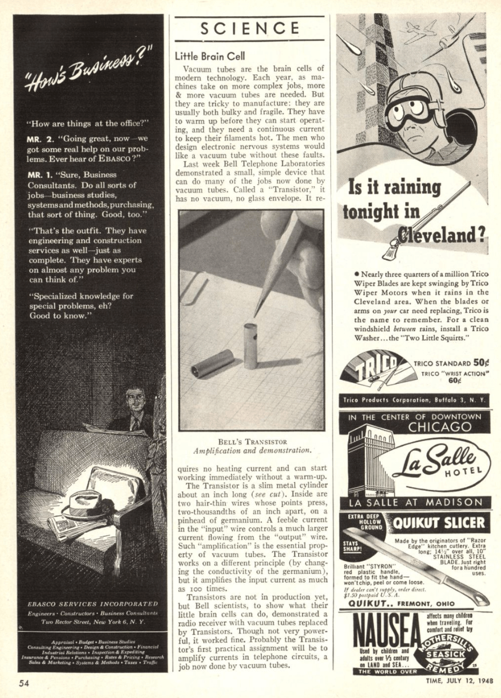

.. _littlebraincell:

================================================
Transistor first reported as "Little Brain Cell"
================================================

*2023 Nov 28*

.. _interview: https://www.latent.space/p/semianalysis

.. _Chip War: https://www.christophermiller.net/semiconductors-1

Last week I listened to the Latent Space `interview`_ with "That
SemiAnalysis Guy". His name is Dylan Patel but I'm going to keep calling him
That SemiAnalysis Guy because it tickles my brain. The interview was great! It
motivated me to finally learn more about the hardware industry. At the end of
the interview That SemiAnalysis Guy recommends `Chip War`_ by Chris Miller, who
will hereby be called "That Chip War Guy". The book was on my radar but I never
got around to reading it because I was pretty turned off by the clickbaity
title. I'm only 50 pages in but it seems like the book is just a
well-researched history of the semiconductor industry...?

I love it when historians mention their primary sources. That Chip War Guy
mentions some of the earliest reporting on the transistor, back in 1948:

    When Bell Labs held a press conference in June 1948 to announce that
    its scientists had invented the transistor, it wasn't easy to
    understand why these wired blocks of germanium merited a special
    announcement. The New York Times buried the story on page 46. Time
    magazine did better, reporting the invention under the headline
    "Little Brain Cell."

.. _full text: https://content.time.com/time/subscriber/article/0,33009,804759,00.html

I dug around a little bit and found the `full text`_. It's pretty short so I'll
save you a click and reproduce it here in full:

    Vacuum tubes are the brain cells of modern technology. Each year, as
    machines take on more complex jobs, more & more vacuum tubes are needed.
    But they are tricky to manufacture: they are usually both bulky and
    fragile. They have to warm up before they can start operating, and they
    need a continuous current to keep their filaments hot. The men who
    design electronic nervous systems would like a vacuum tube without these
    faults.

    Last week Bell Telephone Laboratories demonstrated a small, simple
    device that can do many of the jobs now done by vacuum tubes. Called a
    "Transistor," it has no vacuum, no glass envelope. It requires no
    heating current and can start working immediately without a warmup.

    The Transistor is a slim metal cylinder about an inch long. Inside are
    two hair-thin wires whose points press, two-thousandths of an inch
    apart, on a pinhead of germanium. A feeble current in the "input" wire
    controls a much larger current flowing from the "output" wire. Such
    "amplification" is the essential property of vacuum tubes. The
    Transistor works on a different principle (by changing the conductivity
    of the germanium), but it amplifies the input current as much as 100
    times.

    Transistors are not in production yet, but Bell scientists, to show what
    their little brain cells can do, demonstrated a radio receiver with
    vacuum tubes replaced by Transistors. Though not very powerful, it
    worked fine. Probably the Transistor's first practical assignment will
    be to amplify currents in telephone circuits, a job now done by vacuum
    tubes.

.. _git-go: https://www.deseret.com/1996/11/24/19278907/from-the-get-go-phrase-came-from-american-blacks

It's fascinating to me that we were thinking of this stuff as "electronic
nervous systems" and "little brain cells" from the `git-go`_.

.. _scan: https://time.com/vault/issue/1948-07-12/page/56/

I was also able to find a `scan`_ of the magazine. The web is a vast treasure
trove of historical content.

